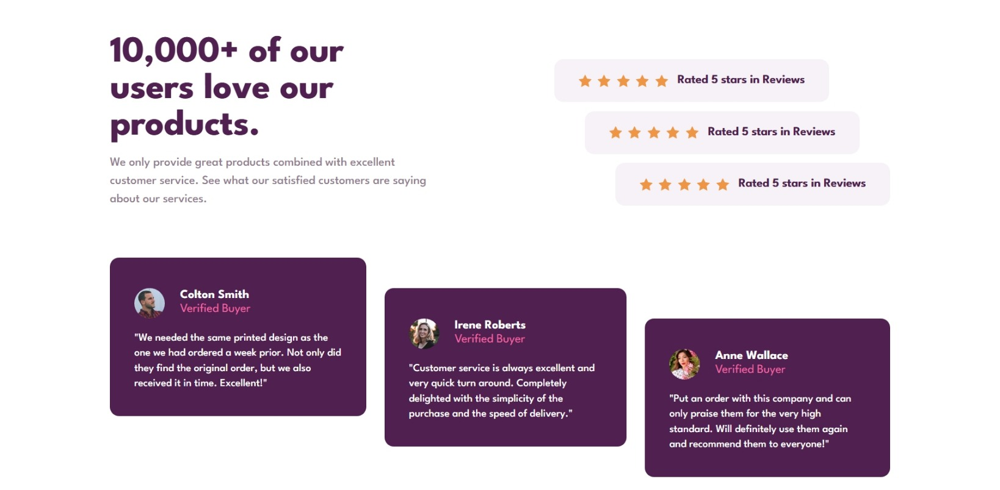

# Frontend Mentor - Social proof section solution

This is a solution to the [Social proof section challenge on Frontend Mentor](https://www.frontendmentor.io/challenges/social-proof-section-6e0qTv_bA). Frontend Mentor challenges help you improve your coding skills by building realistic projects.

## Table of contents

- [Overview](#overview)
  - [Screenshot](#screenshot)
  - [Links](#links)
- [My process](#my-process)
  - [Built with](#built-with)
  - [What I learned](#what-i-learned)
- [Author](#author)

## Overview

### Screenshot

### Links

- Challenge URL: [Frontend Mentor](https://www.frontendmentor.io/challenges/social-proof-section-6e0qTv_bA)
- Live Site URL: [Live URL](https://fg-abc.github.io/FEM-SocialProofSection/)

## My process

I built this project with React and Tailwind CSS.

### Built with

- HTML5
- CSS
- Flexbox
- Tailwind CSS
- React
- Vite

### What I learned

During the making of this project, I've practiced various skills in HTML and CSS, and React.

In CSS,

- I learned when to use the align-content property

In Tailwind,

- I learned to set custom themes in the tailwind config
- I learned to set up tailwind with prettier so the classes aren't messy

## Author

- Frontend Mentor - [@FG-ABC](https://www.frontendmentor.io/profile/FG-ABC)
